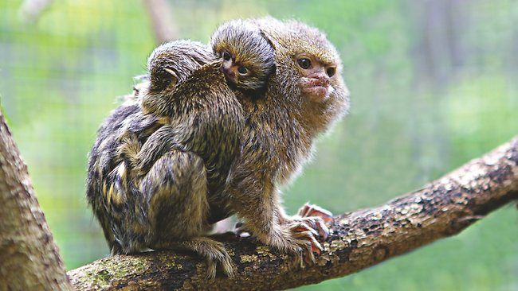
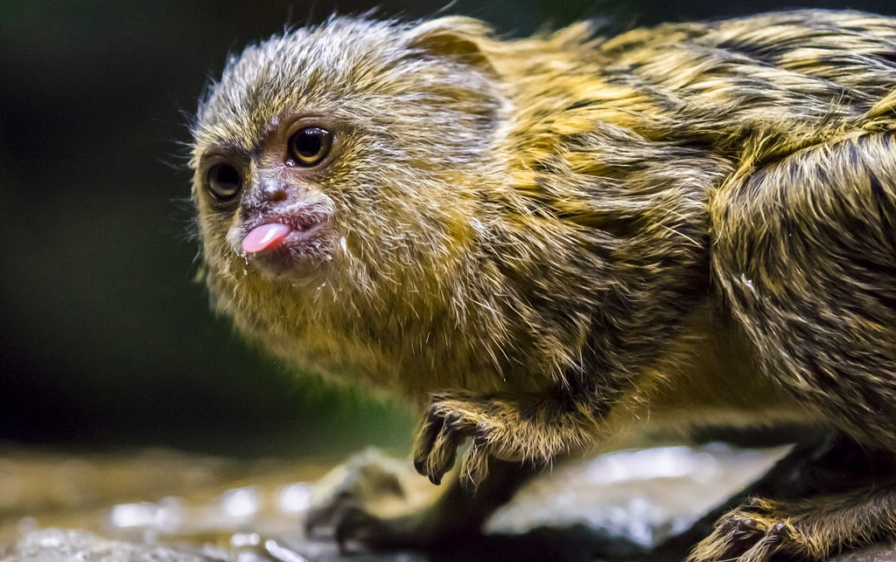
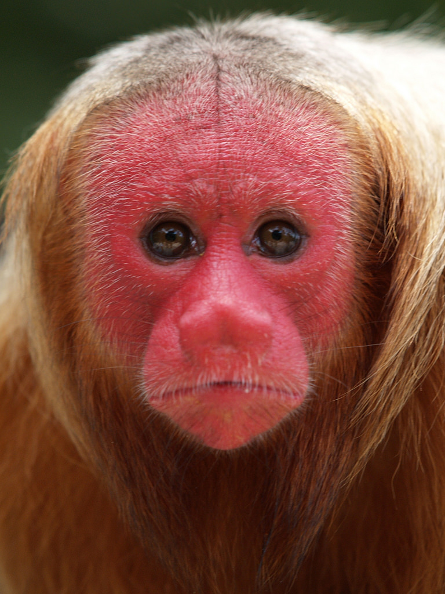

# Monkey classification: with transfer learning from  the _inception3_ model  

## Overview

With augmentation and transfer learning, the model can correctly classify between the ten monkey species with accuracy of ~96% on the validation set. 

#### 1. data preparation
Original images were center-cropped and resized to 250 x 250 x 3.
  
#### 2. data augmentation
I used 3x data augmentation (3 augmented images out of each original) to increase the training sample size. 

#### 3. transfer learning
I used the pre-trained inception3 model but only fine-tuning the last 50 layers. With 4 epochs, batch size of 64, the validation accuracy reached to ~ 96%.  

## Code

This notebook **monkey_aws.ipynb** includes code for data preparation and training (fine-tuning) the _inception3_ model (using an AWS EC2-xlarge instance, 4 CPUs). 

The code for data augmentation is stored in another notebook (**data_sugmentation.ipynb**).

Demonstration of the how the result can be found in notebook **monkey_app.ipynb**.

## Dataset

I use the [**10 Monkey Species** dataset from Kaggle](https://www.kaggle.com/slothkong/10-monkey-species). This dataset includes 10 monkey species, each has ~100 images in training set and ~27 images in the validation set. Images are in _.jpg_ files with varies sizes.

## Examples

(see notebook **monkey_app.ipynb** for the code to generate these examples.)

#### 1. Example from the validation set

Input image:

Predicted species:

### 2. Upload your own image (in _.jpg_, _.jpeg_ or _.png_)

Input image:

Predicted species:

